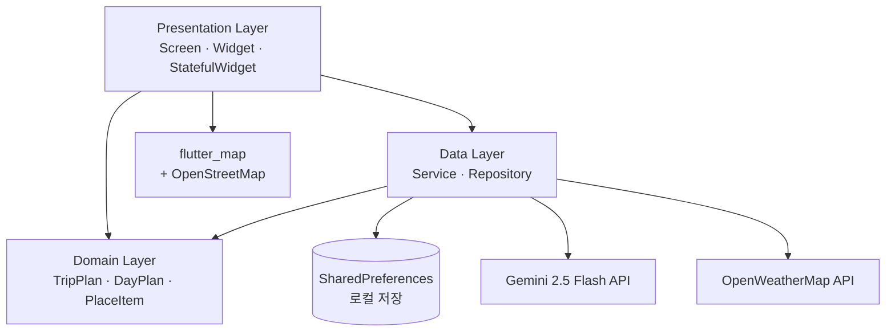
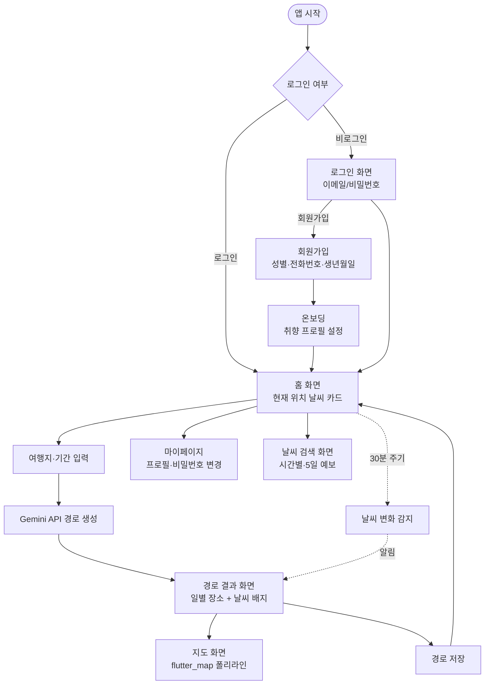

# 아키텍처 — Tripia (AI 여행 경로 추천 앱)

## 1. 시스템 개요

취향 프로필 + 실시간 날씨를 Gemini API에 전달해 개인화된 여행 경로를 생성하고,
SharedPreferences에 로컬로 저장·조회하는 Flutter 웹 앱.

---

## 2. 레이어 구조

3계층 구조로, **Application(상태관리/유스케이스) 레이어는 별도로 두지 않고 화면(StatefulWidget)이 서비스를 직접 호출**한다.



| 레이어 | 책임 | 폴더 |
|--------|------|------|
| **Presentation** | 화면 렌더링, 사용자 입력 처리, 서비스 직접 호출 | `lib/presentation/` |
| **Domain** | 핵심 모델 정의 (TripPlan/DayPlan/PlaceItem), 외부 의존 없음, toJson/fromJson | `lib/domain/models/` |
| **Data** | API 연동(Gemini/OpenWeatherMap), 로컬 저장(SharedPreferences) | `lib/data/services/`, `lib/data/mock/` |
| **Core** | API 키 등 설정 상수 | `lib/core/` |

---

## 3. 디렉토리 구조

```
lib/
├── main.dart                              # 진입점
├── core/
│   └── config.dart                        # API 키 상수 (gitignore, 절대 커밋 금지)
├── domain/
│   └── models/
│       └── trip_plan.dart                 # TripPlan / DayPlan / PlaceItem
├── data/
│   ├── mock/
│   │   └── mock_trip_data.dart            # 오사카·제주·도쿄·파리 더미 데이터
│   └── services/
│       ├── gemini_service.dart            # Gemini 2.5 Flash 연동, JSON 추출
│       ├── weather_service.dart           # OpenWeatherMap, 60+ 도시 매핑
│       ├── weather_monitor_service.dart   # 5초 후 즉시 + 30분 주기 날씨 변화 감지
│       ├── trip_repository.dart           # 경로 저장·조회·삭제
│       └── auth_service.dart              # 이메일 로그인·회원가입·비밀번호 변경
└── presentation/
    ├── app.dart                           # GoRouter 라우팅 (8개 경로)
    └── screens/
        ├── login_screen.dart
        ├── signup_screen.dart
        ├── onboarding_screen.dart
        ├── home_screen.dart
        ├── mypage_screen.dart
        ├── route_input_screen.dart
        ├── route_result_screen.dart
        ├── map_screen.dart
        └── weather_screen.dart
```

---

## 4. 화면 흐름도



---

## 5. 핵심 기능별 흐름

| 기능 | Presentation | Domain | Data |
|------|-------------|--------|------|
| AI 경로 생성 | `RouteInputScreen` → `RouteResultScreen` | `TripPlan`/`DayPlan`/`PlaceItem` | `GeminiService` |
| 경로 저장/조회/삭제 | `RouteResultScreen`, `MyPageScreen` | `TripPlan` | `TripRepository` (SharedPreferences) |
| 지도 시각화 | `MapScreen` | `PlaceItem` (lat/lng) | flutter_map + OpenStreetMap |
| 실시간 날씨 반영 추천 | `HomeScreen`, `RouteResultScreen` | - | `WeatherService` → Gemini 프롬프트 조정 |
| 날씨 변화 감지 재추천 | (백그라운드) | - | `WeatherMonitorService` (Timer) |
| 날씨 검색 | `WeatherScreen` | - | `WeatherService` |
| 로그인/회원가입/마이페이지 | `LoginScreen`, `SignupScreen`, `MyPageScreen` | - | `AuthService` (SharedPreferences) |

---

## 6. 라우팅 (GoRouter, 8개)

| 경로 | 화면 |
|------|------|
| `/` | LoginScreen |
| `/signup` | SignupScreen |
| `/onboarding` | OnboardingScreen |
| `/home` | HomeScreen |
| `/mypage` | MyPageScreen |
| `/route/input` | RouteInputScreen |
| `/route/result` | RouteResultScreen (extra: TripPlan) |
| `/route/map` | MapScreen (extra: TripPlan) |
| `/weather` | WeatherScreen |

---

## 7. 기술 스택 및 ADR

| 영역 | 기술 | ADR |
|------|------|-----|
| 프레임워크 | Flutter 3.x + Dart 3.x (Web 우선) | [ADR-0001](../.planning/decisions/ADR-0001-mobile-framework.md) |
| 상태관리 | StatefulWidget (계획 단계엔 Riverpod) | [ADR-0002](../.planning/decisions/ADR-0002-state-management.md) → [ADR-0004](../.planning/decisions/ADR-0004-state-storage-pivot.md)로 피벗 |
| 백엔드/저장 | SharedPreferences (계획 단계엔 Firebase) | [ADR-0003](../.planning/decisions/ADR-0003-backend-choice.md) → [ADR-0004](../.planning/decisions/ADR-0004-state-storage-pivot.md)로 피벗 |
| AI 추천 | Gemini 2.5 Flash | `gemini_service.dart` |
| 날씨 | OpenWeatherMap API | `weather_service.dart` |
| 지도 | flutter_map + OpenStreetMap | API 키 불필요 |
| 네비게이션 | GoRouter 14.x | 8개 경로 |

---

## 8. 로컬 저장 구조 (SharedPreferences)

Firebase Firestore 대신 SharedPreferences에 JSON으로 직렬화하여 저장한다 (구조는 추후 Firestore 마이그레이션을 고려해 동일하게 설계).

```
key: "users"        → [ { name, email, password, gender, phone, birthDate, ... }, ... ]
key: "currentUser"  → { name, email }
key: "saved_trips"  → [ TripPlan.toJson(), ... ]
```

- `TripPlan`: `{ destination, days, dayPlans: [DayPlan] }`
- `DayPlan`: `{ day, places: [PlaceItem] }`
- `PlaceItem`: `{ time, name, category, description, latitude, longitude }`
