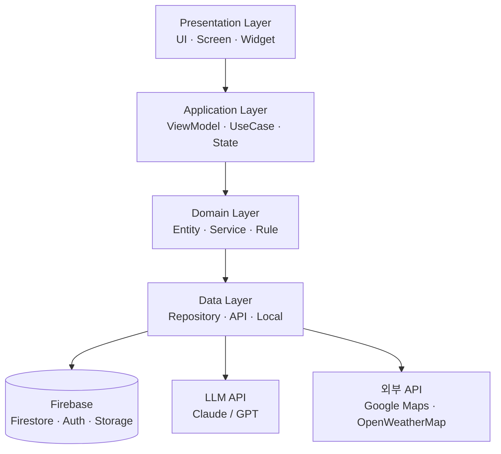
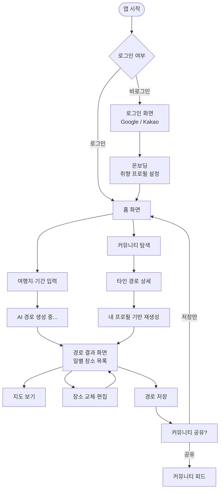

# 아키텍처 — AI 여행 경로 추천 앱

## 1. 시스템 개요

취향 프로필 + 실시간 날씨·위치를 LLM API에 전달해 개인화된 여행 경로를 생성하고,
Firebase에 저장·공유하는 Flutter 앱.

---

## 2. 레이어 구조



| 레이어 | 책임 | 폴더 |
|--------|------|------|
| **Presentation** | 화면 렌더링, 사용자 입력 처리 | `lib/presentation/` |
| **Application** | 비즈니스 흐름 조율, 상태 관리 (Riverpod) | `lib/application/` |
| **Domain** | 핵심 비즈니스 규칙, 엔티티 정의 | `lib/domain/` |
| **Data** | 외부 데이터 소스 접근, Repository 구현 | `lib/data/` |

---

## 3. 디렉토리 구조

```
lib/
├── main.dart                    # 진입점
├── app.dart                     # MaterialApp 루트
├── presentation/
│   ├── screens/                 # 화면 단위 위젯
│   │   ├── home_screen.dart     # 홈 (현재 Hello World)
│   │   ├── login_screen.dart    # 로그인 (12주차)
│   │   ├── onboarding_screen.dart
│   │   ├── route_result_screen.dart
│   │   └── community_screen.dart
│   ├── widgets/                 # 재사용 공통 위젯
│   └── theme/
│       └── app_theme.dart       # 컬러·타이포그래피 토큰
├── application/
│   ├── view_models/             # Riverpod Provider, 화면별 상태
│   ├── use_cases/               # 단일 책임 비즈니스 흐름
│   └── state/                   # 전역 상태 모델
├── domain/
│   ├── entities/                # TravelRoute, UserProfile, Place 등
│   ├── services/                # AI 추천 로직 인터페이스
│   └── rules/                   # 비즈니스 규칙 (예산 검증 등)
└── data/
    ├── repositories/            # Firestore, Local 구현체
    ├── api/                     # LLM API, Weather API, Maps API 클라이언트
    └── local/                   # SharedPreferences 래퍼
```

---

## 4. 화면 흐름도



---

## 5. 핵심 기능별 레이어 흐름

| 기능 | Presentation | Application | Domain | Data |
|------|-------------|-------------|--------|------|
| AI 경로 생성 | `RouteResultScreen` | `RouteViewModel` | `TravelRouteService` | `LlmApiClient` |
| Google 로그인 | `LoginScreen` | `AuthViewModel` | `UserEntity` | `FirebaseAuthRepository` |
| 날씨 기반 재추천 | `HomeScreen` | `WeatherUseCase` | `WeatherRule` | `WeatherApiClient` |
| 커뮤니티 피드 | `CommunityScreen` | `FeedViewModel` | `PostEntity` | `FirestoreRepository` |

---

## 6. 기술 스택

| 영역 | 기술 | 선택 이유 |
|------|------|-----------|
| 클라이언트 | Flutter 3.38 + Dart 3.10 | ADR-0001 참조 |
| 상태관리 | Riverpod 2.x | ADR-0002 참조 |
| 백엔드 | Firebase (Auth + Firestore + Storage) | ADR-0003 참조 |
| 지도 | Google Maps Flutter | 공식 SDK, Firestore와 동일 계정 |
| 날씨 | OpenWeatherMap API | 무료 티어 충분 |
| AI 추천 | Claude API (Anthropic) | 한국어 품질 우수 |
| 네비게이션 | go_router | Flutter 공식 권장 |

---

## 7. Firestore 컬렉션 구조

```
users/{uid}
  └── profile: { style, budget, companion, updatedAt }

routes/{routeId}
  ├── meta: { title, destination, days, authorUid, createdAt }
  ├── days/{dayIndex}
  │   └── places: [ { name, lat, lng, duration, memo } ]
  └── stats: { savedCount, likeCount }

posts/{postId}
  ├── routeId, authorUid, title, imageUrl, createdAt
  └── likes/{uid}: true
```
